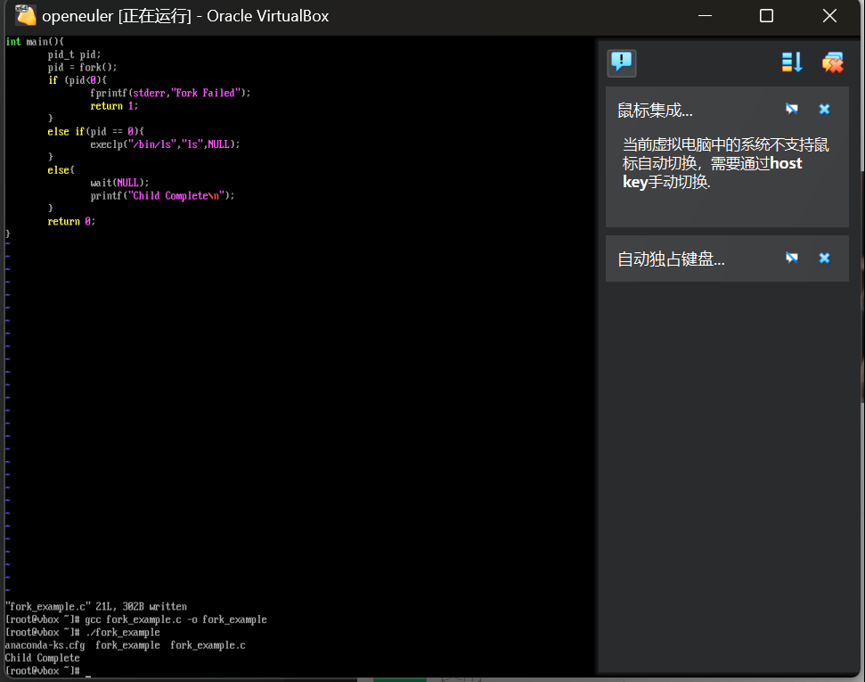

# 实践报告：Linux C代码编译实践报告

## 1. 实验目的

通过编写和运行课堂示例的 C 程序，理解进程创建和程序替换的基本概念，掌握在 openEuler 环境下编辑、编译和运行 C 程序的方法。

---

## 2. 实验环境

- **操作系统**：openEuler
- **编译器**：gcc
- **编辑器**：vim
- **终端工具**：Bash

---

## 3. 实验步骤

### 3.1 安装必要工具

#### 3.1.1 安装 Vim

1. 打开终端，使用以下命令安装 `vim`：
   
   ```bash
   sudo dnf install vim
   ```

2. 验证安装是否成功：
   
   ```bash
   vim --version
   ```
   
   如果显示版本信息，说明安装成功。

#### 3.1.2 安装 GCC

1. 使用以下命令安装 `gcc`：
   
   ```bash
   sudo dnf install gcc
   ```
2. 验证安装是否成功：
   
   ```bash
   gcc --version
   ```
   
   如果显示版本信息，说明安装成功。

---

### 3.2 编辑代码

1. 使用 `vim` 创建并编辑 C 文件：
   
   ```bash
   vim fork_example.c
   ```

2. 将以下代码敲入：
   
   ```c
   #include <sys/types.h>
   #include <stdio.h>
   #include <unistd.h>
   #include <sys/wait.h>  
   
   int main() {
       pid_t pid;
       pid = fork();
       if (pid < 0) { 
           fprintf(stderr, "Fork Failed");
           return 1;
       }
       else if (pid == 0) { 
           execlp("/bin/ls", "ls", NULL);
       }
       else {
           wait(NULL);
           printf("Child Complete\n");
       }
       return 0;
   }
   ```

3. 保存并退出：
   
   - 按 `Esc` 键，然后输入 `:wq`，按 `Enter` 保存并退出。

---

### 3.3 编译代码

1. 使用 `gcc` 编译代码：
   
   ```bash
   gcc fork_example.c -o fork_example
   ```
2. 如果编译成功，会生成一个可执行文件 `fork_example`。

---

### 3.4 运行代码

1. 运行生成的可执行文件：
   
   ```bash
   ./fork_example
   ```
2. 观察输出结果，应该会显示当前目录的文件列表（由子进程执行 `ls` 命令），然后输出 `Child Complete`（由父进程打印）。

---

## 4. 实验结果

- **输出示例**：
  
  ```
  file1.txt  file2.txt  fork_example
  Child Complete
  ```
- **结果分析**：
  - 子进程成功执行了 `ls` 命令，列出了当前目录的文件。
  - 父进程等待子进程结束后，打印了 `Child Complete`。

---

## 5. 实验总结

通过本次实验，成功实现了以下目标：

1. 使用 `fork()` 创建子进程，理解了父子进程的执行流程。
2. 使用 `execlp()` 在子进程中替换程序映像，执行 `ls` 命令。
3. 使用 `wait()` 确保父进程等待子进程结束。
4. 掌握了在 openEuler 环境下安装工具、编辑代码、编译和运行 C 程序的基本方法。

---

## 6. 遇到的问题与解决方法

1. **问题**：编译时提示 `wait` 函数隐式声明。
   - **解决方法**：在代码中添加 `#include <sys/wait.h>` 头文件。
2. **问题**：`vim` 或 `gcc` 未安装。
   - **解决方法**：使用 `dnf` 包管理器安装 `vim` 和 `gcc`。

---

## 7. 附录：完整代码

```c
#include <sys/types.h>
#include <stdio.h>
#include <unistd.h>
#include <sys/wait.h>  // 添加这行以解决 wait 函数的隐式声明问题

int main() {
    pid_t pid;
    /* fork another process */
    pid = fork();
    if (pid < 0) { /* error occurred */
        fprintf(stderr, "Fork Failed");
        return 1;
    }
    else if (pid == 0) { /* child process */
        execlp("/bin/ls", "ls", NULL);
    }
    else { /* parent process */
        /* parent will wait for the child */
        wait(NULL);
        printf("Child Complete\n");
    }
    return 0;
}
```

---

## 8. 实验截图

以下是实验过程中的截图：
   

---
