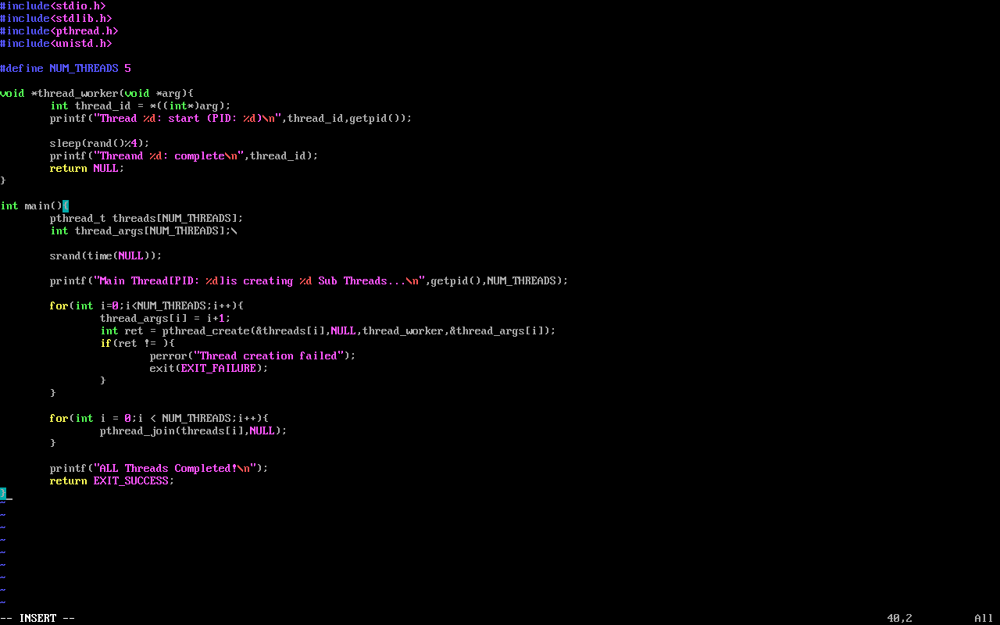
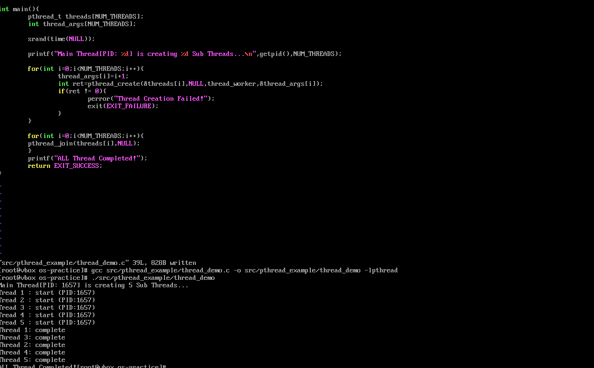

# 多线程编程报告
任务1：用部署好的openeuler环境，在命令行下编辑并编译
任务2：用git创建并初始化自己的os实践项目，将每次HW实践和未来的上机都在项目目录下建立单独的子目录，并利用git工具管理好每一次的修改
## 1. 创建项目目录结构
```bash
mkdir -p os-practice/{HW1,HW2,HW3,src,docs}  # 创建项目目录及子目录
cd os-practice
```

## 2. 初始化Git仓库
```bash
git init
git config --global user.name "zhr"
git config --global user.email "3147075611@qq.com"
```

## 3. 创建.gitignore文件
```bash
cat > .gitignore <<EOF
*.o
*.swp
*.out
__pycache__/
.DS_Store
EOF
```

## 4. 编写多线程示例代码(以五个线程为例)
```bash
mkdir -p src/pthread_example
vim src/pthread_example/thread_demo.c
```

代码内容：
```c
#include <stdio.h>
#include <stdlib.h>
#include <pthread.h>
#include <unistd.h>

#define NUM_THREADS 5  // 线程数量

/* 线程工作函数 */
void *thread_worker(void *arg) {
    int thread_id = *((int *)arg);
    printf("Thread %d: start (PID: %d)\n", thread_id, getpid());
    
    // 模拟工作（随机延时0-3秒）
    sleep(rand() % 4);
    
    printf("Thread %d: complete\n", thread_id);
    return NULL;
}

int main() {
    pthread_t threads[NUM_THREADS];
    int thread_args[NUM_THREADS];  // 每个线程的参数
    
    srand(time(NULL));  // 初始化随机数种子

    printf("Main Thread[PID: %d] is creating %d Sub Threads...\n", getpid(), NUM_THREADS);

    /* 创建多个线程 */
    for (int i = 0; i < NUM_THREADS; i++) {
        thread_args[i] = i + 1;  // 线程编号从1开始
        
        int ret = pthread_create(&threads[i], NULL, 
                               thread_worker, &thread_args[i]);
        if (ret != 0) {
            perror("Threads Creation Failed!");
            exit(EXIT_FAILURE);
        }
    }

    /* 等待所有线程完成 */
    for (int i = 0; i < NUM_THREADS; i++) {
        pthread_join(threads[i], NULL);
    }

    printf("All Threads Completed！\n");
    return EXIT_SUCCESS;
}
```
代码截图： 

## 5. 编译运行多线程程序
```bash
gcc src/pthread_example/thread_demo.c -o src/pthread_example/thread_demo -lpthread
./src/pthread_example/thread_demo
```

## 7. 运行结果截图
 