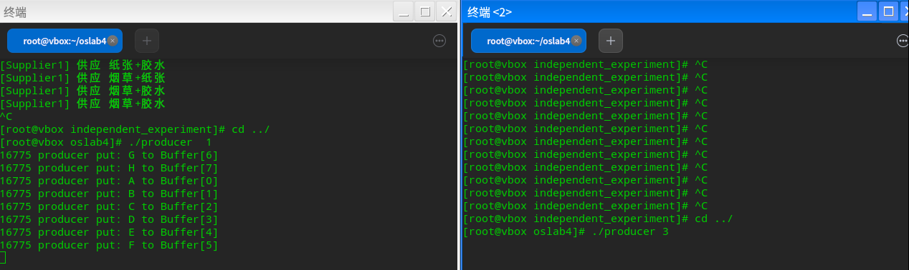
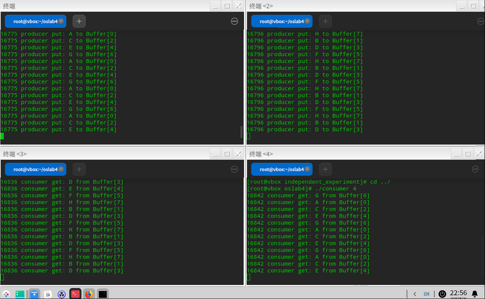
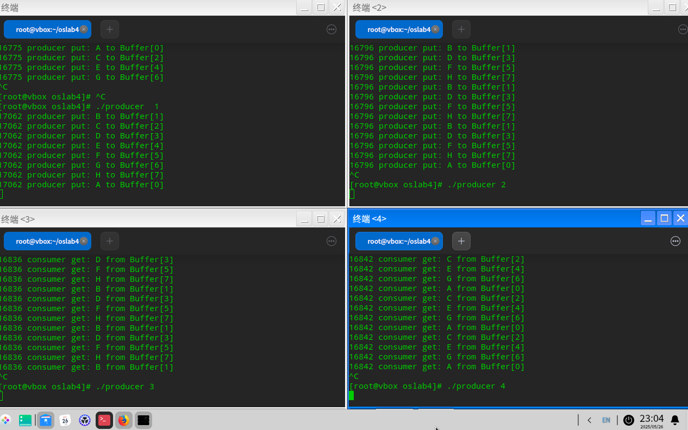
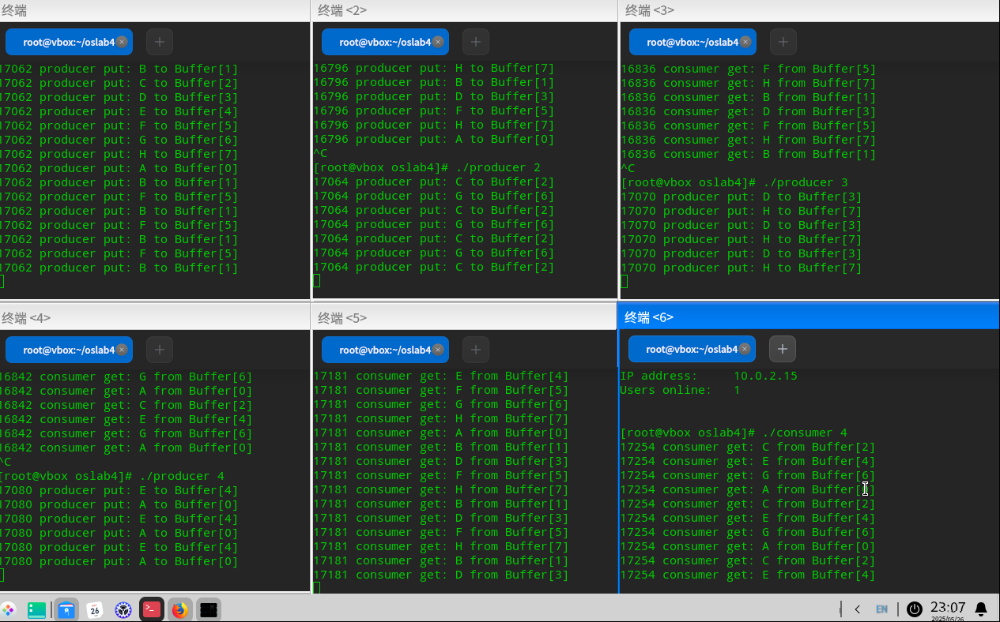
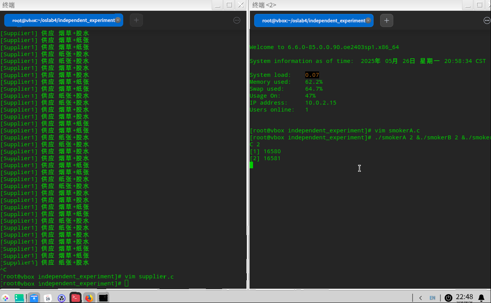
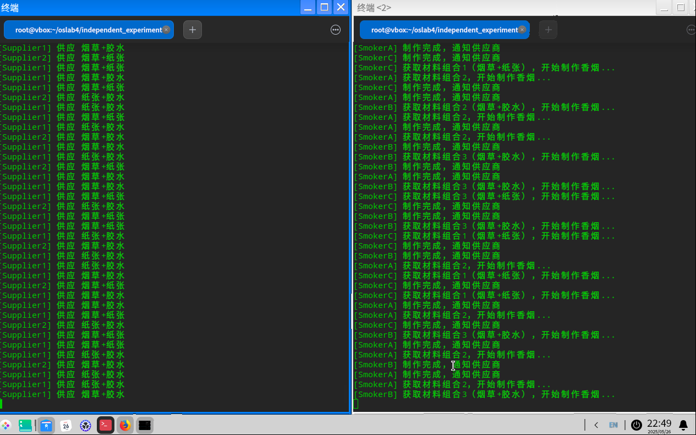
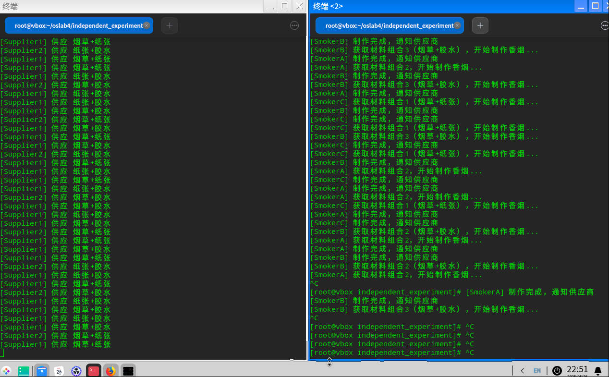

# oslab4实验报告-20232241297-赵鹤然-网2303

## 1.目标
加深对并发协作进程同步与互斥概念的理解，观察和体验并发进程同步与互斥操作的效果，分析与研究经典进程同步与互斥问题的实际解决方案。了解Linux系统中IPC进程同步工具的用法，练习并发协作进程的同步与互斥操作的编程与调试技术。

## 2.实验要求
根据示例实验程序和独立实验程序中观察和记录的信息，结合生产者/消费者问题和抽烟者问题的算法的原理，说明真实操作系统中提供的并发进程同步机制是怎样实现和解决同步问题的，它们是怎样应用操作系统教材中讲解的进程同步原理的？对应教材中信号灯的定义，说明信号灯机制是怎样完成进程的互斥和同步的？其中信号量的初值和其值的变化的物理意义是什么？使用多于 4 个的生产者和消费者，以各种不同的启动顺序、不同的执行速率检测以上示例程序和独立实验程序是否都能满足同步的要求。

### 一、真实操作系统中提供的并发进程同步机制是怎样实现和解决同步问题的？
#### 一、同步机制
##### （一）互斥锁
作为并发控制领域的基础工具，互斥锁通过二元状态管理实现关键资源的独占式访问。其运作机制表现为：当进程/线程尝试访问受保护资源时，需首先完成锁状态获取操作。
**若目标锁处于`释放`状态，请求者立即获得访问权限并将锁标记为`占用`；若锁已被`占用`，请求者进入`阻塞`队列等待锁持有者释放资源。**
这种机制有效预防了多执行流并发修改共享数据引发的竞态冲突，典型应用场景包括文件系统元数据更新、内存页表操作等需要原子性保障的临界区保护。

##### （二）信号量
区别于互斥锁的二元控制，信号量通过数值型计数器实现多维度资源调度。该机制包含两个原子操作原语：**`P操作`执行`条件等待与资源扣除`，`V操作`完成`资源释放与线程唤醒`。** 
其核心价值在于既能实现互斥锁的二元控制（通过二值信号量），又能支持资源池管理等复杂场景。在分布式系统事务协调、线程池任务调度等场景中，计数型信号量可精确控制并发访问量级。


#### 二、生产者-消费者问题分析
##### （一）缓冲区双信号量控制
建立`empty/full`互补信号量组，分别表征缓冲区空槽容量（初始值为N）与有效数据量（初始值0）。**生产线程通过P(empty)获取写入权限，完成数据注入后执行V(full)；消费线程则通过P(full)取得读取权限，数据处理后执行V(empty)。** 此设计确保缓冲区利用率维持在安全阈值内，避免溢出或空转。

##### （二）互斥锁控制
在缓冲区读写操作外围嵌套互斥锁，防止多个生产/消费线程同时修改缓冲区索引指针。例如：
```c
pthread_mutex_lock(&buf_mutex);  // 进入缓冲区管理临界区
item = buffer[out];             // 消费端数据提取
out = (out + 1) % BUFFER_SIZE;
pthread_mutex_unlock(&buf_mutex);
```
#### 三、抽烟者问题分析
##### （一）互斥锁（mutex_sem）

在供应商进程中，修改共享内存中的supply->type前需获取互斥锁。这一操作确保同一时刻仅有一个进程能更新材料类型，避免多个供应商同时写入导致数据冲突。例如，当两个供应商试图分别设置类型1和类型2时，互斥锁强制其串行执行，保证最终结果符合预期。

##### （二）信号量的分工与协作
**1. supply_sem（供应控制器）**
- 初始值1：允许首次供应立即执行，触发生产-消费循环。
- 操作逻辑：
供应商通过down(supply_sem)获取供应权，若值为0则等待。
抽烟者完成制作后调用up(supply_sem)释放许可，驱动下一次供应。
作用：确保供应商与抽烟者交替工作，防止资源过度堆积。
**2. smokerX_sem（唤醒触发器）**
- 初始值0：表示初始状态下无可用材料。
- 动态激活：
供应商根据材料类型调用对应信号量的up()（如供应类型1时触发smokerC_sem）。
抽烟者在各自信号量上执行down()阻塞，直到所需材料就绪。
### 二、信号灯机制是怎样完成进程的互斥和同步的？

#### （一）互斥信号灯：
互斥信号灯的计数器初始值为1，用于实现互斥锁的功能。它只允许一个进程访问特定的资源。
- **P操作**：当进程需要访问资源时，它会执行P操作。如果信号灯的计数器大于0，计数器减1，进程继续执行。如果计数器为0，则进程将被阻塞，直到信号灯的值大于0。
- **V操作**：当进程完成对资源的访问后，它会执行V操作。这将信号灯的计数器增加1，如果有其他进程在等待，操作系统会选择一个进程唤醒它。

#### （二）计数信号灯：
计数信号灯的计数器初始值可以是任意正整数，用于控制多个进程对资源的访问。

- **P操作**：如果信号灯的计数器大于0，计数器减1，进程可以访问资源。如果计数器为0，进程将被阻塞。
- **V操作**：计数器增加1，如果有进程在等待，操作系统将选择一个进程并唤醒它。

#### （三）互斥和同步的实现：
1. **互斥**：通过互斥信号灯，可以保证在任何时刻只有一个进程可以访问特定的资源。这是通过P操作来实现的，如果信号灯的值大于0，进程可以进入临界区；如果为0，则进程将被阻塞，直到信号灯的值变为正数。

2. **同步**：计数信号灯可以用于同步多个进程的执行。例如，一个进程可以等待其他进程完成初始化工作后再开始执行。这可以通过设置信号灯的初始值为0，然后让其他进程在完成初始化后执行V操作来实现。

### 三、信号量的初值和其值的变化的物理意义是什么?

- **信号量的初值**：反映了系统开始时可用资源的数量或者特定条件的满足程度。
- **信号量值的减少**：表示资源被占用，或者某个条件不再满足。
- **信号量值的增加**：表示资源被释放，或者某个条件再次满足。
### 四、使用多于 4 个的生产者和消费者
**（一）运行截图（按PDF要求：）**
在当前终端窗体中启动执行速率为 1 秒的一个生产者进程

打开另一终端窗体，进入当前工作目录，从中再启动另一执行速率为 3 的生产者进程

**（二）多于四个的调试截图**
在四个终端窗体中分别启动执行速率为 1、2、3、4 秒的生产者进程，执行速率为1的生产者连续写入了 8 个字符后因为缓冲区满而阻塞，其后2、3、4均阻塞

分别加入一个速率为3（终端5）和速率为4（终端6）的消费者，同步执行情况如下

### 五、独立实验————抽烟者问题
假设一个系统中有三个抽烟者进程，每个抽烟者不断地卷烟并抽
烟。抽烟者卷起并抽掉一颗烟需要有三种材料：烟草、纸和胶水。一个抽烟者有烟
草，一个有纸，另一个有胶水。系统中还有两个供应者进程，它们无限地供应所有
三种材料，但每次仅轮流提供三种材料中的两种。得到缺失的两种材料的抽烟者在
卷起并抽掉一颗烟后会发信号通知供应者，让它继续提供另外的两种材料。这一过
程重复进行。 请用以上介绍的 IPC 同步机制编程，实现该问题要求的功能。
#### （一）代码
1. ipc.h
```h
#ifndef IPC_H
#define IPC_H

#include <stdio.h>
#include <stdlib.h>
#include <sys/ipc.h>
#include <sys/sem.h>
#include <sys/shm.h>
#include <unistd.h>

// 共享内存数据结构
typedef struct {
    int type; // 1: 烟草+纸 2: 纸+胶水 3: 烟草+胶水
} Supply;

// 信号量键值定义
#define SUPPLY_SEM_KEY 501
#define SMOKERA_SEM_KEY 601
#define SMOKERB_SEM_KEY 602
#define SMOKERC_SEM_KEY 603
#define MUTEX_KEY 701

// 共享内存键值
#define SHM_KEY 201

// 函数声明
void* set_shm(key_t key, size_t size, int flags);
int set_sem(key_t key, int init_val, int flags);
void down(int semid);
void up(int semid);

#endif
```
2.ipc.c
```c
#include "ipc.h"

void* set_shm(key_t key, size_t size, int flags) {
    int shmid;
    if ((shmid = shmget(key, size, flags)) == -1) {
        perror("shmget failed");
        exit(EXIT_FAILURE);
    }
    
    void *ptr;
    if ((ptr = shmat(shmid, NULL, 0)) == (void *)-1) {
        perror("shmat failed");
        exit(EXIT_FAILURE);
    }
    return ptr;
}

int set_sem(key_t key, int init_val, int flags) {
    int semid;
    if ((semid = semget(key, 1, flags)) == -1) {
        perror("semget failed");
        exit(EXIT_FAILURE);
    }
    
    union semun {
        int val;
        struct semid_ds *buf;
        unsigned short *array;
    } arg;
    arg.val = init_val;
    
    if (semctl(semid, 0, SETVAL, arg) == -1) {
        perror("semctl failed");
        exit(EXIT_FAILURE);
    }
    return semid;
}

void down(int semid) {
    struct sembuf op = {0, -1, SEM_UNDO};
    if (semop(semid, &op, 1) == -1) {
        perror("semop down failed");
        exit(EXIT_FAILURE);
    }
}

void up(int semid) {
    struct sembuf op = {0, 1, SEM_UNDO};
    if (semop(semid, &op, 1) == -1) {
        perror("semop up failed");
        exit(EXIT_FAILURE);
    }
}
```
3.supplier.c
```c
#include "ipc.h"

int main(int argc, char *argv[]) {
    int rate = argc > 1 ? atoi(argv[1]) : 1;
    int supplier_id = argc > 2 ? atoi(argv[2]) : 0;

    // 初始化共享内存
    Supply* supply = (Supply*)set_shm(SHM_KEY, sizeof(Supply), IPC_CREAT | 0644);
    
    // 初始化信号量
    int mutex_sem = set_sem(MUTEX_KEY, 1, IPC_CREAT | 0644);
    int supply_sem = set_sem(SUPPLY_SEM_KEY, 1, IPC_CREAT | 0644);
    int smokerA_sem = set_sem(SMOKERA_SEM_KEY, 0, IPC_CREAT | 0644);
    int smokerB_sem = set_sem(SMOKERB_SEM_KEY, 0, IPC_CREAT | 0644);
    int smokerC_sem = set_sem(SMOKERC_SEM_KEY, 0, IPC_CREAT | 0644);

    while(1) {
        down(supply_sem); // 等待供应许可
        
        down(mutex_sem); // 进入临界区
        
        // 轮换提供三种组合
        static int supply_type = 0;
        supply_type = (supply_type % 3) + 1;
        supply->type = supply_type;

        // 触发对应抽烟者
        switch(supply_type) {
            case 1: 
                up(smokerC_sem);
                printf("[Supplier%d] 供应 烟草+纸张\n", supplier_id);
                break;
            case 2: 
                up(smokerA_sem);
                printf("[Supplier%d] 供应 纸张+胶水\n", supplier_id);
                break;
            case 3: 
                up(smokerB_sem);
                printf("[Supplier%d] 供应 烟草+胶水\n", supplier_id);
                break;
        }
        
        up(mutex_sem); // 离开临界区
        sleep(rate);
    }
    return 0;
}
```
4.smokerA.c(smokerB\smokerC代码类似)
```c
#include "ipc.h"

int main(int argc, char *argv[]) {
    int rate = argc > 1 ? atoi(argv[1]) : 1;

    // 初始化共享内存
    Supply* supply = (Supply*)set_shm(SHM_KEY, sizeof(Supply), IPC_CREAT | 0644);
    
    // 初始化信号量
    int smoker_sem = set_sem(SMOKERA_SEM_KEY, 0, IPC_CREAT | 0644);
    int supply_sem = set_sem(SUPPLY_SEM_KEY, 0, IPC_CREAT | 0644);

    while(1) {
        down(smoker_sem); // 等待材料
        
        printf("[SmokerA] 获取材料组合%d，开始制作香烟...\n", supply->type);
        sleep(rate);
        
        up(supply_sem); // 通知供应者
        printf("[SmokerA] 制作完成，通知供应商\n");
    }
    return 0;
}
```
5.Makefile
```makefile
CC = gcc
CFLAGS = -Wall
TARGETS = supplier smokerA smokerB smokerC

all: $(TARGETS)

supplier: supplier.o ipc.o
	$(CC) $(CFLAGS) -o $@ $^

smokerA: smokerA.o ipc.o
	$(CC) $(CFLAGS) -o $@ $^

smokerB: smokerB.o ipc.o
	$(CC) $(CFLAGS) -o $@ $^

smokerC: smokerC.o ipc.o
	$(CC) $(CFLAGS) -o $@ $^

clean:
	rm -f *.o $(TARGETS)

.PHONY: all clean
```
#### (二)运行截图
先设置3个速率为2的抽烟者（右），因未设置供给者进程，抽烟者进程阻塞

再设置两个速率为1的供给者，进程同步运行结果如下

当抽烟者进程被停止，供给者进程也进入阻塞状态

