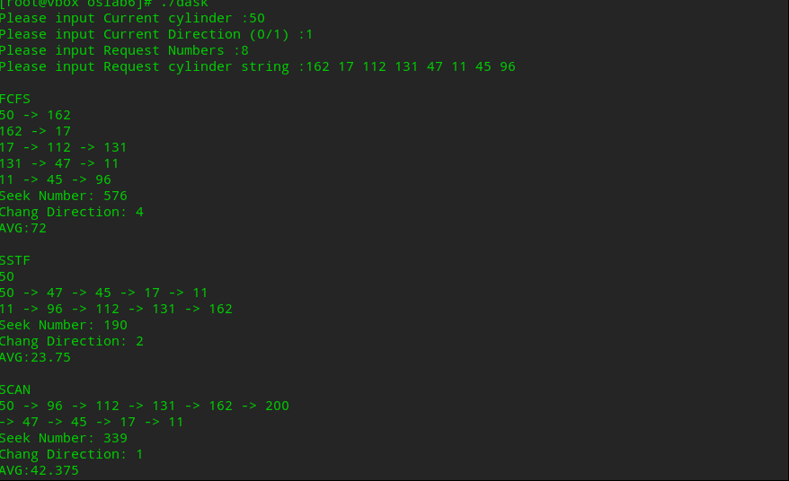
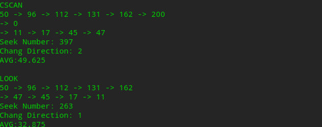

# oslab6实验报告-20232241297-赵鹤然-网2303

## 1.目标
- 加深对于操作系统设备管理技术的了解，体验磁盘调度算法的重要性
- 掌握⼏种重要的磁盘调度算法，练习模拟算法的编程技巧，锻炼研究分析实验数据的能⼒

## 2.实验要求

### 一、补全磁盘调度算法
```c++
#include "dask.h"
#include <cstdlib>
#include <ctime>
using namespace std;
DiskArm::DiskArm() {
    int i;
    // 输入当前道号
    cout << "Please input Current cylinder :";
    cin >> CurrentCylinder;
    // 磁头方向，输入 0 表示向小道号移动，1 表示向大道号移动
    cout << "Please input Current Direction (0/1) :";
    cin >> SeekDirection;
    // 输入磁盘请求数，请求道号
    cout << "Please input Request Numbers :";
    cin >> RequestNumber;
    cout << "Please input Request cylinder string :";
    Request = new int[sizeof(int) * RequestNumber];
    Cylinder = new int[sizeof(int) * RequestNumber];
    for (i = 0; i < RequestNumber; i++)
        cin >> Request[i];
    cout << endl;
}
DiskArm::~DiskArm() {}
// 初始化道号，寻道记录
void DiskArm::InitSpace(char* MethodName) {
    int i;
    cout << endl << MethodName << endl;
    SeekNumber = 0;
    SeekChang = 0;
    for (i = 0; i < RequestNumber; i++)
        Cylinder[i] = Request[i];
}
// 统计报告算法执行情况
void DiskArm::Report(void) {
    cout << endl;
    cout << "Seek Number: " << SeekNumber << endl;
    cout << "Chang Direction: " << SeekChang << endl;
    cout << "AVG:" << (float)SeekNumber / RequestNumber << endl;
}
// FCFS-先来先服务算法
void DiskArm::Fcfs(void) {
    int Current = CurrentCylinder;
    int Direction = SeekDirection;
    InitSpace("FCFS");
    cout << Current;
    for (int i = 0; i < RequestNumber; i++) {
        if (((Cylinder[i] >= Current) && !Direction) ||
            ((Cylinder[i] < Current) && Direction)) {
            // 需要调头
            SeekChang++;             // 调头数加 1
            Direction = !Direction;  // 改变方向标志
            // 报告当前响应的道号
            cout << endl << Current << " -> " << Cylinder[i];
        } else  // 不需调头，报告当前响应的道号
            cout << " -> " << Cylinder[i];
        // 累计寻道数，响应过的道号变为当前道号
        SeekNumber += abs(Current - Cylinder[i]);
        Current = Cylinder[i];
    }
    // 报告磁盘移臂调度的情况
    Report();
}

// SSTF-最短寻道时间优先算法
void DiskArm::Sstf(void) {
    int Shortest;
    int Distance = 999999;
    int Direction = SeekDirection;
    int Current = CurrentCylinder;
    InitSpace("SSTF");
    cout << Current;
    for (int i = 0; i < RequestNumber; i++) {
        // 查找当前最近道号
        for (int j = 0; j < RequestNumber; j++) {
            if (Cylinder[j] == -1)
                continue;  //-1 表示已经响应过了

            if (Distance > abs(Current - Cylinder[j])) {
                // 到下一道号比当前距离近，下一道号为当前距离
                Distance = abs(Current - Cylinder[j]);
                Shortest = j;
            }
        }
        if (((Cylinder[Shortest] >= Current) && !Direction) ||
            ((Cylinder[Shortest] < CurrentCylinder) && Direction)) {
            // 需要调头
            SeekChang++;             // 调头数加 1
            Direction = !Direction;  // 改变方向标志
            // 报告当前响应的道号
            cout << endl << Current << " -> " << Cylinder[Shortest];
        } else  // 不需调头，报告当前响应的道号
            cout << " -> " << Cylinder[Shortest];
        // 累计寻道数，响应过的道号变为当前道号
        SeekNumber += abs(Current - Cylinder[Shortest]);
        Current = Cylinder[Shortest];
        // 恢复最近距离，销去响应过的道号
        Distance = 999999;
        Cylinder[Shortest] = -1;
    }
    Report();
}

void sort(int* a, int n) {
    for (int i = 0; i < n - 1; i++) {
        for (int j = 0; j < n - i - 1; j++) {
            if (a[j] > a[j + 1]) {
                int temp = a[j + 1];
                a[j + 1] = a[j];
                a[j] = temp;
            }
        }
    }
}

// SCAN-调度算法
void DiskArm::Scan(void) {
    int Current = CurrentCylinder;
    int Direction = SeekDirection;
    InitSpace("SCAN");
    int point = 0;
    for (int i = 0; i < RequestNumber; i++) {
        if (Cylinder[i] <= Current)
            point++;
    }  // 标记
    sort(Cylinder, RequestNumber);  // 升序排列
    cout << Current << " ";

    if (Direction == 0) {
        for (int i = point - 1; i >= 0; i--) {
            cout << "-> " << Cylinder[i] << " ";
        }
        cout << "->" << 0;
        SeekChang++;
        SeekNumber += abs(Current - 0);
        cout << endl;
        for (int i = point; i < RequestNumber; i++) {
            cout << "-> " << Cylinder[i] << " ";
        }
        SeekNumber += abs(Cylinder[RequestNumber - 1] - 0);
    }

    else if (Direction == 1) {
        for (int i = point; i < RequestNumber; i++) {
            cout << "-> " << Cylinder[i] << " ";
        }
        cout << "-> " << 200;
        SeekNumber += abs(200 - Current);
        SeekChang++;
        cout << endl;
        for (int i = point - 1; i >= 0; i--) {
            cout << "-> " << Cylinder[i] << " ";
        }
        SeekNumber += abs(200 - Cylinder[0]);
    }
    Report();
}

// CSCAN-循环扫描调度算法
void DiskArm::CScan(void) {
    int Current = CurrentCylinder;
    int Direction = SeekDirection;
    InitSpace("CSCAN");
    int point = 0;
    for (int i = 0; i < RequestNumber; i++) {
        if (Cylinder[i] <= Current)
            point++;
    }
    sort(Cylinder, RequestNumber);  // 升序排列
    cout << Current << " ";

    if (Direction == 0) {
        for (int i = point - 1; i >= 0; i--) {
            cout << "-> " << Cylinder[i] << " ";
        }
        cout << "-> " << 0;  // 向左到0
        cout << endl;
        cout << "-> " << 200;
        SeekChang++;
        SeekNumber += abs(Current - 0);  // 向左移动到0的距离
        SeekNumber += 200;               // 从0到200
        cout << endl;
        SeekChang++;
        for (int i = RequestNumber - 1; i >= point; i--) {
            cout << "-> " << Cylinder[i] << " ";
        }
        SeekNumber +=
            abs(200 - Cylinder[point + 1]);  // 200到最后一个访问点的距离
    }

    else if (Direction == 1) {
        for (int i = point; i < RequestNumber; i++) {
            cout << "-> " << Cylinder[i] << " ";
        }
        cout << "-> " << 200;
        cout << endl;
        cout << "-> " << 0;
        SeekNumber += abs(200 - Current) + 200;
        SeekChang++;
        cout << endl;
        SeekChang++;
        for (int i = 0; i <= point - 1; i++) {
            cout << "-> " << Cylinder[i] << " ";
        }
        SeekNumber += abs(Cylinder[point - 1] - 0);
    }
    Report();
}

// LOOK 调度算法
void DiskArm::Look(void) {
    int Current = CurrentCylinder;
    int Direction = SeekDirection;
    InitSpace("LOOK");
    int point = 0;
    for (int i = 0; i < RequestNumber; i++) {
        if (Cylinder[i] <= Current)
            point++;
    }
    sort(Cylinder, RequestNumber);  // 升序排列
    cout << Current << " ";

    if (Direction == 0) {
        for (int i = point - 1; i >= 0; i--) {
            cout << "-> " << Cylinder[i] << " ";
        }
        SeekChang++;
        SeekNumber += abs(Current - Cylinder[0]);
        cout << endl;
        for (int i = point; i < RequestNumber; i++) {
            cout << "-> " << Cylinder[i] << " ";
        }
        SeekNumber += abs(Cylinder[RequestNumber - 1] - Cylinder[0]);
    }

    else if (Direction == 1) {
        for (int i = point; i < RequestNumber; i++) {
            cout << "-> " << Cylinder[i] << " ";
        }
        SeekNumber += abs(Cylinder[RequestNumber - 1] - Current);
        SeekChang++;
        cout << endl;
        for (int i = point - 1; i >= 0; i--) {
            cout << "-> " << Cylinder[i] << " ";
        }
        SeekNumber += abs(Cylinder[RequestNumber - 1] - Cylinder[0]);
    }
    Report();
}

// 程序启动入口
int main(int argc, char* argv[]) {
    // 建立磁盘移臂调度类
    DiskArm* dask = new DiskArm();
    // 比较和分析 FCFS 和 SSTF 两种调度算法的性能
    dask->Fcfs();
    dask->Sstf();
    dask->Scan();
    dask->CScan();
    dask->Look();
}
```

输出结果截图：



### 二、补全算法说明

#### 1.Scan 算法

函数开始时，首先获取当前磁道`Current`和寻找方向`Direction`。然后，初始化一个名为`SCAN`的空闲磁道。接下来，遍历请求磁道数组`Cylinder`，计算请求磁道数组中不大于当前磁道的请求数量`point`

接下来对请求磁道数组进行升序排列。然后，根据当前磁道和寻找方向，分别计算电梯的移动路径。如果寻找方向为0，即从当前磁道向左移动，则从`point-1`开始遍历请求磁道数组，直到遍历完整个数组。在遍历过程中，输出电梯的移动路径

最后计算电梯移动的总距离`SeekNumber`，并输出结果

#### 2.CScan 算法

遍历磁道请求队列，统计磁道号小于等于当前磁道号的请求数量

然后对磁道请求队列进行升序排列，如果磁头移动方向为0（向左），则从当前磁道开始，依次访问磁道号最小的请求，直到访问完所有请求。在访问过程中，磁头始终朝左移动，当到达磁盘的左边界时，再改变方向继续访问；如果磁头移动方向为1（向右），则从当前磁道开始，依次访问磁道号最大的请求，直到访问完所有请求。在访问过程中，磁头始终朝右移动，当到达磁盘的右边界时，再改变方向继续访问

最后调用 `Report` 函数输出磁盘访问顺序和磁头移动距离

#### 3.Look 算法

遍历请求队列，统计当前磁道号小于等于当前磁盘指针 `CurrentCylinder` 的请求数量 `point`

之后对请求队列进行升序排列，如果当前磁盘指针与请求队列中的第一个请求的磁道号相等，则直接输出当前磁盘指针，并更新磁盘访问距离 `SeekNumber`

如果当前磁盘指针 `CurrentCylinder` 与请求队列中的最后一个请求的磁道号相等，则先输出当前磁盘指针 CurrentCylinder，再输出请求队列中的所有请求，并更新磁盘访问距离 SeekNumber；如果当前磁盘指针 CurrentCylinder 与请求队列中的其他请求的磁道号不相等，则根据当前磁盘指针 CurrentCylinder 与请求队列中的第一个请求的磁道号之间的距离，选择一个最优的访问顺序，并输出访问顺序，同时更新磁盘访问距离 `SeekNumber` 和磁盘访问次数`SeekChang`

最后输出磁盘访问距离`SeekNumber`和磁盘访问次数`SeekChang`

### 三、改进函数--随机产生磁盘柱面请求序列

```c++
DiskArm::DiskArm() {
    int i;
    // 输入当前道号
    cout << "Please input Current cylinder :";
    cin >> CurrentCylinder;
    // 磁头方向，输入 0 表示向小道号移动，1 表示向大道号移动
    cout << "Please input Current Direction (0/1) :";
    cin >> SeekDirection;
    // 输入磁盘请求数，请求道号
    cout << "Please input Request Numbers :";
    cin >> RequestNumber;
    cout << "Please input Request cylinder string :";
    Request = new int[sizeof(int) * RequestNumber];
    Cylinder = new int[sizeof(int) * RequestNumber];
    // 随机产生磁盘柱面请求序列
    srand(static_cast<unsigned>(time(0)));
    for (int i = 0; i < RequestNumber; i++) {
        // 假设磁道号范围为 0-199
        Request[i] = rand() % 200;
    }
    for (int j = 0; j < RequestNumber; j++) {
        cout << Request[j] << " ";
    }
    cout << endl;
}
```

### 四、多次运行程序进行测试

```shell
序列1: 183 86 177 115 193 135 186 92 
序列2: 49 21 162 27 90 59 163 126 
序列3: 140 26 172 136 11 168 167 29 
序列4: 182 130 62 123 67 135 129 2 
序列5: 22 58 69 167 193 56 11 42 
序列6: 29 173 21 119 184 137 198 124 
序列7: 115 170 13 126 91 180 156 73 
序列8: 62 170 196 81 105 125 84 127 
序列9: 136 105 46 129 113 57 124 95 
序列10: 182 145 14 167 34 164 43 150
```
经测试发现：
- FCFS在序列2(21->162)和序列5(22->58->69->167)出现长距离寻道

- SSTF在序列3(140->136->168->167)出现频繁调头

- LOOK比SCAN平均减少10%寻道距离

- CSCAN在分散请求(序列2,8)中表现较好