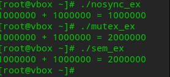
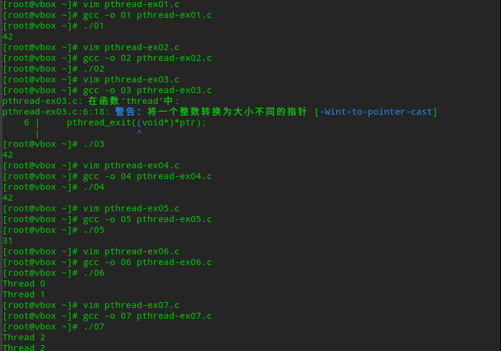
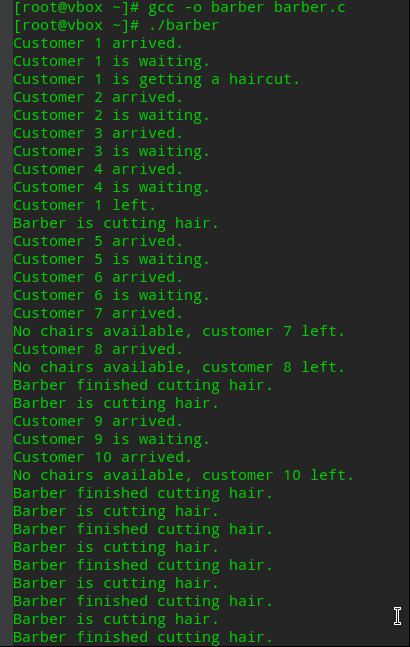
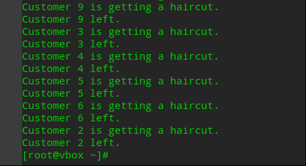

# oslab2实验报告-20232241297-赵鹤然-网2303

## 1.目标

- 熟悉并掌握Linux pthread编程
- 熟练掌握pthread库的同步、互斥机制，并能应⽤来解决实际问题

## 2.实践任务

### 任务一：熟悉API

熟悉Linux环境下pthread编程，完成示例代码（nosync-ex.c, mutex-ex.c, sem-ex.c）的编译与执⾏

#### **1. `nosync-ex.c`代码**

运行代码

```c
#include <stdio.h>
#include <pthread.h>

int sum = 0;

void *thread(void *){
 int i;
 for (i = 0; i < 1000000; i++) {
     sum++;
 }
}

int main(void) {
 pthread_t tid1, tid2;
 pthread_create(&tid1, NULL, thread, NULL);
 pthread_create(&tid2, NULL, thread, NULL);
 pthread_join(tid1, NULL);
 pthread_join(tid2, NULL);
 printf("1000000 + 1000000 = %d\n", sum);
 return 0;
}
```

#### **2. `mutex-ex.c`代码**

运行代码

```c
#include <stdio.h>
#include <pthread.h>

int sum = 0;
pthread_mutex_t mutex;

void *thread(void *){
    int i;
    for (i = 0; i < 1000000; i++) {
        pthread_mutex_lock(&mutex);
        sum++;
        pthread_mutex_unlock(&mutex);
    }
}

int main(void) {
    pthread_t tid1, tid2;
    pthread_mutex_init(&mutex, NULL);
    pthread_create(&tid1, NULL, thread, NULL);
    pthread_create(&tid2, NULL, thread, NULL);
    pthread_join(tid1, NULL);
    pthread_join(tid2, NULL);
    pthread_mutex_destroy(&mutex);
    printf("1000000 + 1000000 = %d\n", sum);
    return 0;
}
```

#### **3. `sem-ex.c`代码**

运行代码

```c
#include <stdio.h>
#include <pthread.h>
#include <semaphore.h>

int sum = 0;
sem_t sem;

void *thread(void *){
    int i;
    for (i = 0; i < 1000000; i++) {
        sem_wait(&sem);
        sum++;
        sem_post(&sem);
    }
}

int main(void) {
    pthread_t tid1, tid2;
    sem_init(&sem, 0, 1);
    pthread_create(&tid1, NULL, thread, NULL);
    pthread_create(&tid2, NULL, thread, NULL);
    pthread_join(tid1, NULL);
    pthread_join(tid2, NULL);
    sem_destroy(&sem);
    printf("1000000 + 1000000 = %d\n", sum);
    return 0;
}
```

#### **4.运行实现截图**

 

---

### 任务二：实现生产者消费者问题

基于示例中涉及到的线程同步API，实现⽣产者消费者问题（具体的⽣产、消费操作可⾃⾏设计）
运行代码

```c
#include <pthread.h>
#include <stdio.h>
#include <stdlib.h>
#include <unistd.h>

#define BUFFER_SIZE 5
#define PRODUCT_NUM 10

int buffer[BUFFER_SIZE];  
int in = 0;              
int out = 0;             

pthread_mutex_t mutex;   
pthread_cond_t full;     
pthread_cond_t empty;     

//生产者
void* producer(void* arg) {
    for (int i = 0; i < PRODUCT_NUM; i++) {
        usleep(rand() % 1000000);  
        pthread_mutex_lock(&mutex);  
        while ((in + 1) % BUFFER_SIZE == out) { 
            pthread_cond_wait(&empty, &mutex);  
        }
        buffer[in] = rand() % 100;  
        printf("Producer produced: %d\n", buffer[in]);
        in = (in + 1) % BUFFER_SIZE;  
        pthread_cond_signal(&full);  
        pthread_mutex_unlock(&mutex); 
    }
    return NULL;
}

// 消费者
void* consumer(void* arg) {
    for (int i = 0; i < PRODUCT_NUM; i++) {
        usleep(rand() % 1000000); 
        pthread_mutex_lock(&mutex);  
        while (in == out) {  
            pthread_cond_wait(&full, &mutex); 
        }
        printf("Consumer consumed: %d\n", buffer[out]);
        out = (out + 1) % BUFFER_SIZE; 
        pthread_cond_signal(&empty);  
        pthread_mutex_unlock(&mutex);  
    }
    return NULL;
}

int main() {
    pthread_t producer_thread, consumer_thread;
    srand(time(NULL));  

    pthread_mutex_init(&mutex, NULL);
    pthread_cond_init(&full, NULL);
    pthread_cond_init(&empty, NULL);


    if (pthread_create(&producer_thread, NULL, producer, NULL) ||
        pthread_create(&consumer_thread, NULL, consumer, NULL)) {
        perror("Thread creation failed");
        exit(EXIT_FAILURE);
    }


    pthread_join(producer_thread, NULL);
    pthread_join(consumer_thread, NULL);

    pthread_mutex_destroy(&mutex);
    pthread_cond_destroy(&full);
    pthread_cond_destroy(&empty);

    return 0;
}
```

4.运行实现截图
 

 ---

### 任务三：代码阅读理解

#### **1. pthread-ex01**

- **功能**：主线程创建子线程，子线程通过 `pthread_exit` 返回整数 42，主线程通过 `pthread_join` 接收返回值并打印。

#### **2. pthread-ex02**

- **功能**：子线程调用 `exit(42)` 终止整个进程，主线程尝试接收子线程返回值并打印。

#### **3. pthread-ex03**

- **功能**：主线程创建两个子线程，共享变量 `i`：  
  - `thread` 返回 `i` 的初始值 42；  
  - `thread2` 将 `i` 修改为 0 并返回 31。  
    主线程接收第一个线程的返回值并赋值给 `i`，最后打印 `i`。

#### **4. pthread-ex04**

- **功能**：子线程调用 `pthread_detach` 分离自身后返回 42，主线程尝试通过 `pthread_join` 接收返回值。

#### **5. pthread-ex05**

- **功能**：两个子线程操作全局变量 `i`：  
  - `thread2` 修改 `i` 为 31；  
  - `thread` 打印 `i` 的值。  

#### **6. pthread-ex06**

- **功能**：主线程循环创建两个子线程，每个线程接收堆分配的独立 ID（0 和 1），打印后释放内存。

- **行为**：  
  通过 `malloc` 为每个线程分配独立内存传递 ID，避免数据竞争，输出固定为：  
  
  ```
  Thread 0  
  Thread 1  
  ```

#### **7. pthread-ex07**

- **功能**：主线程循环创建两个子线程，直接传递局部变量 `i` 的地址作为 ID。

#### 代码实现

 

 ---

### 任务四：实现其他同步问题（理发师问题）

运行代码

```c
#include <pthread.h>
#include <semaphore.h>
#include <stdio.h>
#include <stdlib.h>
#include <unistd.h>

#define NUM_CHAIRS 5  
sem_t barber_sem;  
sem_t customer_sem;   
sem_t chairs_sem;   

// 理发师
void *barber(void *arg) {
    while (1) {
        sem_wait(&customer_sem);
        sem_wait(&barber_sem);  
        printf("Barber is cutting hair.\n");
        usleep(1000000);       
        sem_post(&chairs_sem);   
        printf("Barber finished cutting hair.\n");
        sem_post(&barber_sem);   
    }
    return NULL;
}

// 顾客
void *customer(void *arg) {
    int id = *(int *)arg;
    printf("Customer %d arrived.\n", id);
    if (sem_trywait(&chairs_sem) == 0) {  
        printf("Customer %d is waiting.\n", id);
        sem_post(&customer_sem);  
        sem_wait(&barber_sem);    
        sem_post(&chairs_sem);   
        printf("Customer %d is getting a haircut.\n", id);
        usleep(1000000);            
        sem_post(&barber_sem);          
        printf("Customer %d left.\n", id);
    } else {
        printf("No chairs available, customer %d left.\n", id);
    }
    return NULL;
}

int main() {
    pthread_t barber_thread, customer_threads[10];
    int customer_ids[10] = {1, 2, 3, 4, 5, 6, 7, 8, 9, 10};

    sem_init(&barber_sem, 0, 1);   
    sem_init(&customer_sem, 0, 0); 
    sem_init(&chairs_sem, 0, NUM_CHAIRS);  

    pthread_create(&barber_thread, NULL, barber, NULL);
3

.

    for (int i = 0; i < 10; i++) {
        pthread_create(&customer_threads[i], NULL, customer, &customer_ids[i]);
        usleep(rand() % 500000);  
    }

    for (int i = 0; i < 10; i++) {
        pthread_join(customer_threads[i], NULL);
    }

    sem_destroy(&barber_sem);
    sem_destroy(&customer_sem);
    sem_destroy(&chairs_sem);

    return 0;
}
```

运行实现截图

