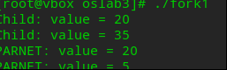
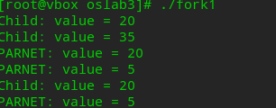
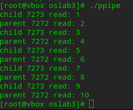
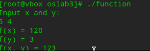

# oslab3实验报告-20232241297-赵鹤然-网2303

## 1.目标
- 通过熟悉Linux系统中的管道通信机制，加深对进程通信概念的理解
- 观察和体验并发进程间通信和协作的效果
- 练习利⽤⽆名管道进⾏进程通信的编程和调试技术


## 2.实践任务
### 任务一：fork1
输入代码并观察、解释输出结果。 fork1.c，看注释思考问题

#### **1. `fork.c`代码**
运行代码
   ```c
  #include <sys/types.h>
#include <stdio.h>
#include <unistd.h>
#include <stdlib.h>
#include <wait.h>

int value=5;     //where?

int main(){
	
	int i;     //where?
	
	pid_t pid;
	
	for(i=0;i<2;i++){    // How many new processes and printfs
		
	
		pid=fork();
	
		if(pid==0){
			value += 15;
			printf("Child: value = %d\n",value);
		}
		else if(pid>0){
			wait(NULL);
			printf("PARNET: value = %d\n",value);
			exit(0);   //Notice:What will happen with or without this line?
		}
	}
}
```

#### **2. 注释问题分析**
**1.变量定义在哪？**
- value=5 
全局变量，存储在**数据段**，所有进程共享初始值，但每个进程修改的是自己的副本
- int i
局部变量，存储在**栈**中，每个进程独立拥有

---

**2.多少进程、多少输出？**
共**3**个进程，即**父进程、子进程、子进程的子进程**，共**4**次调用printf,输出结果见后图未注释exit(0)部分截图

---

**3、是否注释掉`exit(0);`有何影响？**
- **未注释exit(0)**

执行过程：父进程进入 `for` 循环，此时 `i = 0` ，父进程创建一个子进程，称为子进程1。此时父进程进入 `else if` 分支，在 `wait(NULL)` 处阻塞，等待子进程1结束。

子进程1进入 `if` 分支，`value` 加15变成20，打印出 `Child: value = 20`，第一次 `for` 循环结束，`i` 自增一次变成1

第二次 `for` 循环，子进程1创建一个子进程，称为子进程2，子进程1变成父进程，进入 `else if` 分支，在 `wait(NULL)` 处阻塞，等待子进程2结束

子进程2进入 `if` 分支，`value` 加15变成35，打印出 `Child: value = 35`，第二次 `for` 循环结束，`i` 自增一次变成2，不满足 `for` 循环条件，循环结束，子进程2结束

子进程1阻塞终止，打印 `PARNET: value = 20`，子进程1结束，父进程阻塞终止，打印 `PARNET: value = 5`

- **注释exit(0)后**

如果没有 `exit(0)`，则子进程1作为父进程不会立刻退出，子进程1的第一次 `for` 循环结束，`i` 自增变成2，不满足 `for` 循环条件，循环结束

父进程也不会立刻退出，`i` 自增一次变成1，创建新的子进程，称为子进程3。此时父进程进入 `else if` 分支，在 `wait(NULL)` 处阻塞，等待子进程3结束。

子进程3进入 `if` 分支，`value` 加15变成20，打印出 `Child: value = 20`，第一次 `for` 循环结束，`i` 自增一次变成2，，不满足 `for` 循环条件，循环结束，子进程3结束

父进程阻塞终止，打印 `PARNET: value = 5`，父进程结束，父进程阻塞终止，打印 `PARNET: value = 5`

#### **3. 运行截图**
- 未注释exit(0)语句



- 注释exit(0)后
  


---
### 任务二：独立实验
掌握如何通过管道实现进程间通信
- 阅读⽰例的代码，编译执⾏，并加以理解
- 完成独立实验

#### **1. ppipe编译与执行**
运行截图
  

#### **2. f(x,y) = f(x) + f(y)**
运行代码
```c
#include <stdio.h>
#include <stdlib.h>
#include <sys/types.h>
#include <unistd.h>
#include <wait.h>

int fx(int x) {
    if (x == 1)
        return 1;
    return x * fx(x - 1);
}

int fy(int y) {
    if (y == 1 || y == 2)
        return 1;
    return fy(y - 1) + fy(y - 2);
}

int main() {
    pid_t pid_fx, pid_fy;
    int x, y;
    printf("Input x and y:\n");
    scanf("%d %d", &x, &y);

    //f(x)
    pid_fx = fork();
    if (pid_fx == 0) {
        printf("f(x) = %d\n", fx(x));
        exit(0);
    }

    //f(y)
    pid_fy = fork();
    if (pid_fy == 0) {
        printf("f(y) = %d\n", fy(y));
        exit(0);
    }

    wait(NULL);
    wait(NULL);

    printf("f(x, y) = %d\n", fx(x) + fy(y));

    return 0;
}
```
#### **3. 运行截图**
